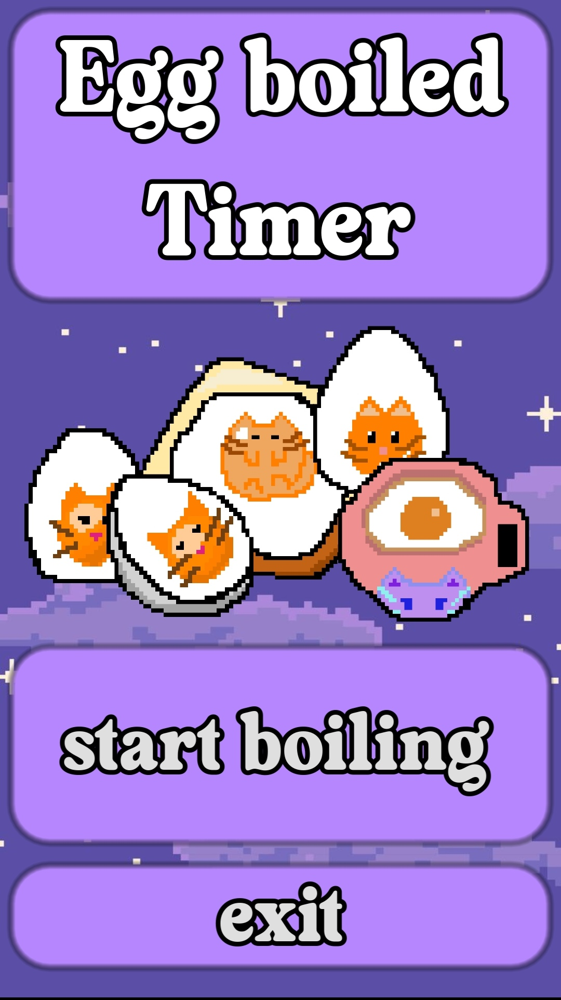
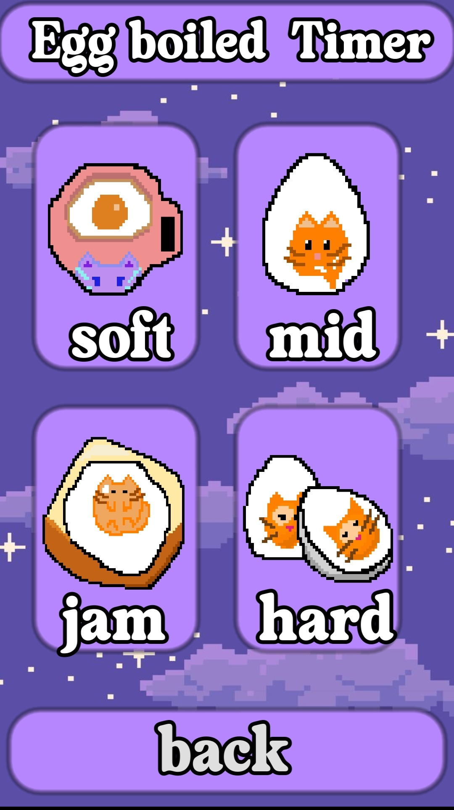
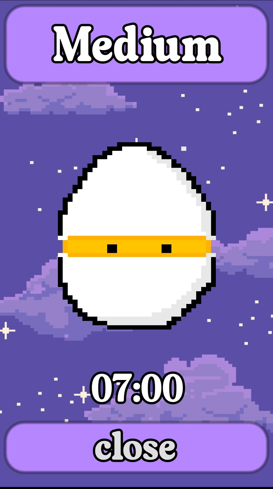

# 🥚 Egg Boiled Timer

Το **Egg Boiled Timer** είναι μια χαλαρωτική και πρακτική εφαρμογή, φτιαγμένη στη μηχανή γραφικών Godot. Σας βοηθάει να βράσετε τα αυγά σας ακριβώς όπως τα θέλετε, συνοδεία χαλαρωτικής μουσικής!

  
  
  

##  Χαρακτηριστικά Εφαρμογής

* **4 Επιλογές Βρασμού:** Επιλέξτε το ιδανικό αυγό για εσάς:
  *  **Soft:** 
  *  **Mid:** 
  *  **Jam:** 
  *  **Hard:** 
* **Lo-Fi Ατμόσφαιρα:** Όσο το χρονόμετρο μετράει αντίστροφα, παίζει χαλαρωτική lo-fi μουσική για να κάνετε την αναμονή σας πιο ευχάριστη.
* **Ηχητική Ειδοποίηση (Alarm):** Μόλις ο χρόνος τελειώσει, ένα χαρακτηριστικό κουδούνισμα σας ειδοποιεί ότι τα αυγά σας είναι έτοιμα!
* **Pixel-Art Αισθητική:** Πανέμορφο, custom UI με χαριτωμένα γραφικά (cat-eggs) και νυχτερινό ουρανό.

##  Πώς λειτουργεί

1. Ανοίγετε την εφαρμογή και πατάτε **"start boiling"**.
2. Διαλέγετε τον τύπο αυγού που επιθυμείτε (soft, mid, jam, hard).
3. Το αντίστοιχο χρονόμετρο ξεκινάει αυτόματα (π.χ. 07:00 για το medium) και η μουσική αρχίζει να παίζει.
4. Μόλις μηδενιστεί ο χρόνος, ακούγεται το ξυπνητήρι! 
5. Μπορείτε να διακόψετε τη διαδικασία οποιαδήποτε στιγμή πατώντας **"close"** ή **"back"**.

##  Εγκατάσταση & Εκτέλεση

Η εφαρμογή είναι έτοιμη για χρήση, χωρίς να απαιτείται εγκατάσταση της Godot:

1. Πηγαίνετε στην ενότητα **Releases** (στη δεξιά πλευρά της σελίδας).
2. Κατεβάστε το αρχείο  της εφαρμογής στο κινητό σας
4. Τρέξτε το εκτελέσιμο αρχείο 

##  Εργαλεία που χρησιμοποιήθηκαν
* **Game/App Engine:** Godot Engine
* **Γλώσσα Προγραμματισμού:** GDScript
* **Γραφικά:** Custom Pixel Art
* **Ήχος:** Lo-fi background music & Alarm SFX

---
*Δημιουργήθηκε από την [Αγγελικη Σιμιγδάλη](https://github.com/simigdalius).*
